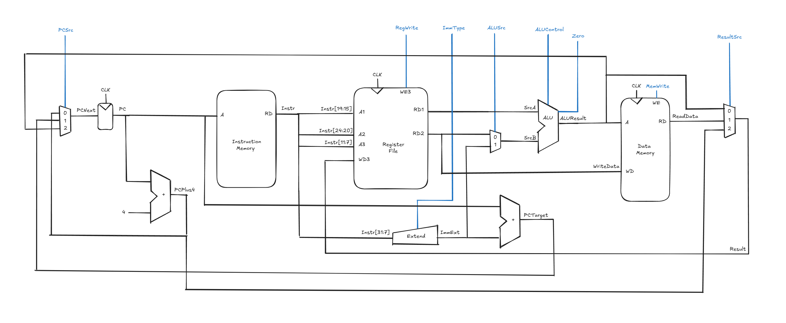

# RISC-V Single Cycle Processor

## Overview
A single cycle processor implemented in VHDL, capable of executing 17 32-bit RISC-V instructions. 

## Installation

### 1. Prerequisites
- ModelSim or any VHDL-compatible simulator

### 2. Clone the Repository
```bash
git clone https://github.com/tebsjejsn/risc-v-processor-single.git
cd risc-v-processor-single
```

## Running the Project

### 1. Open in ModelSim
- Create a new project and add all `.vhd` source files from the `src/` directory
- Compile in dependency order (e.g. ALU → datapath → top-level)

### 2. Run the Simulation
- Set the testbench as the top-level module
- Run the simulation and inspect the waveform

## Features

### Processor Capabilities
- Integer arithmetic
- Memory access
- Branching and jumps
- Immediate instructions

### Instruction Set
|  Type  |              Instructions             |
|--------|---------------------------------------|
| R-type | ADD, SUB, AND, OR, XOR, SLT           |
| I-type | ADDI, XORI, ORI, ANDI, SLTI, LW, JALR |
| S-type | SW                                    |
| B-type | BEQ, BNE                              |
| J-type | JAL                                   |

### Datapath Diagram


## Built With
- VHDL (VHSIC Hardware Description Language)
- ModelSim (HDL Simulation Environment)

## Test

## License
Distributed under the MIT License. See `LICENSE` for more information.